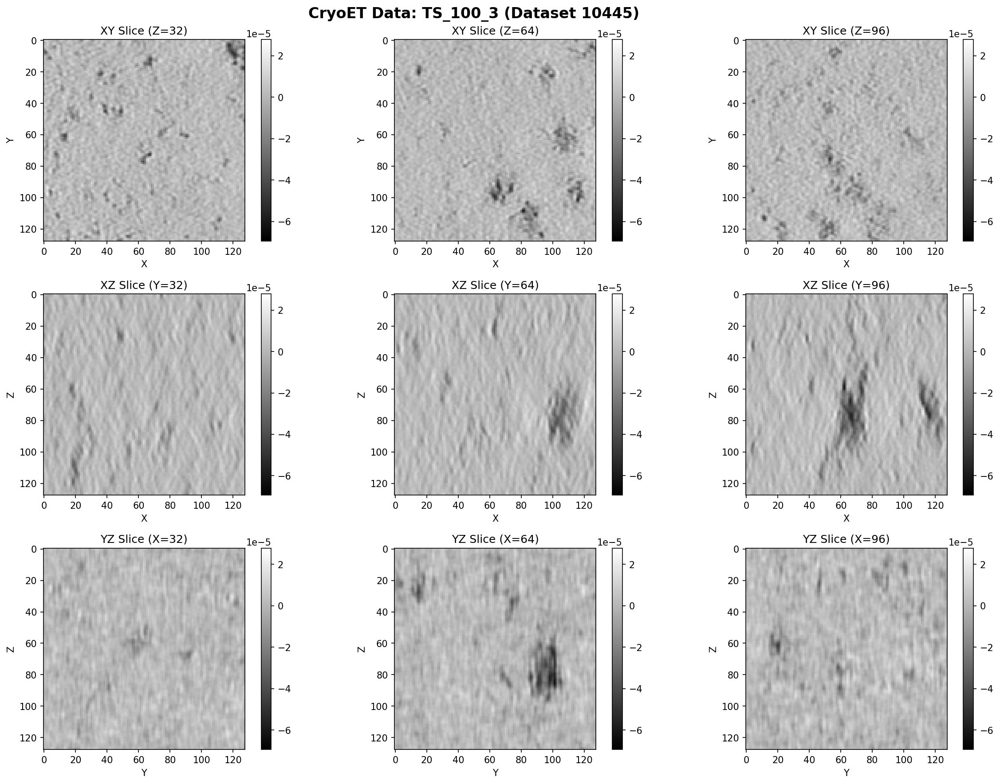

# Example Outputs Gallery

Visual results from the CryoET benchmarking suite.

---

## 📊 Compression Benchmarks

### Benchmark Comparison


**What it shows:**
- Top-left: Write performance across 4 compression methods
- Top-right: Read performance comparison
- Bottom-left: Compression ratio achieved (higher is better)
- Bottom-right: Storage size in MB (lower is better)

**Key findings:**
- Blosc-Zstd achieves best compression (1.17×)
- Read performance excellent across all methods (<5ms for 8MB)
- Write overhead minimal (~10ms for compression)

---

## 🗂️ Chunking Analysis

### Chunking Performance


**What it shows:**
- Top-left: Write time decreases dramatically with larger chunks
- Top-middle: Read performance varies by operation type
- Top-right: **File count reduction** (log scale) - critical metric!
- Bottom-left: Compression ratio consistent across chunk sizes
- Bottom-middle: Storage size nearly identical
- Bottom-right: Efficiency analysis (chunk read time vs overhead)

**Key findings:**
- 16³ chunks → 513 files
- 64³ chunks → 9 files (98% reduction!)
- 128³ chunks → 2 files (99.6% reduction!)
- Non-cubic chunks 4× faster for slice viewing

---

## 📸 CryoET Data Visualization

### Quick Visualization


**What it shows:**
- Top row: Three orthogonal slice views (XY, XZ, YZ)
- Bottom-left: Intensity histogram showing data distribution
- Bottom-middle: Data statistics (shape, min, max, mean, std)

**Data characteristics:**
- Real tomogram from CryoET Portal (Dataset 10445)
- 128³ voxels, float32 type
- Normalized around zero (typical for processed cryo-EM)
- Clear biological structures visible as dark features

---

### Detailed Slice Views


**What it shows:**
- 9-panel view with slices at different positions
- Row 1: XY slices at 3 Z positions
- Row 2: XZ slices at 3 Y positions
- Row 3: YZ slices at 3 X positions

**Observations:**
- Side views show characteristic "missing wedge" artifacts (vertical streaking)
- This is expected in cryo-ET due to limited tilt angles (~±60°)
- Top views show relatively uniform background with scattered features
- Dark regions indicate biological structures (proteins, complexes)

---

### Distribution Analysis


**What it shows:**
- Left: Histogram of all voxel intensities
- Right: Box plots comparing three Z-slice positions

**Findings:**
- Near-perfect Gaussian distribution
- Very tight range (±6×10⁻⁵)
- Consistent across all Z-slices
- Indicates high-quality normalization by CryoET Portal

---

## 📈 Results Tables

### Compression Results (CSV)

From `data/output/cryoet_benchmarks/`:

| Method | Write (s) | Read (s) | Compression | Size (MB) | Savings |
|--------|-----------|----------|-------------|-----------|---------|
| Blosc-Zstd | 0.013 | 0.004 | 1.17× | 6.85 | 14.4% |
| Blosc-LZ4 | 0.009 | 0.005 | 1.09× | 7.31 | 8.6% |
| Zstd | 0.005 | 0.003 | 1.08× | 7.41 | 7.4% |
| No compression | 0.003 | 0.002 | 1.00× | 8.00 | 0% |

### Chunking Results (CSV)

From `data/output/chunking_benchmarks/chunking_results.csv`:

| Chunk Size | Files | Write (s) | Full Read (s) | Slice Read (ms) |
|------------|-------|-----------|---------------|-----------------|
| 16³ | 513 | 0.229 | 0.039 | 3.6 |
| 32³ | 65 | 0.075 | 0.012 | 2.4 |
| 64³ | 9 | 0.024 | 0.005 | 1.7 |
| 128³ | 2 | 0.012 | 0.002 | 1.7 |
| (16,128,128) | 9 | 0.022 | 0.004 | **0.4** ⭐ |

**⭐ Winner:** Non-cubic chunks optimized for XY slicing!

---

## 🗄️ Zarr Store Examples

### File Structure Comparison

**16³ chunks (513 files):**
```
chunks_16.zarr/
├── .zarray
├── 0.0.0
├── 0.0.1
├── 0.0.2
...
└── 7.7.7  (512 chunk files!)
```

**64³ chunks (9 files):**
```
chunks_64.zarr/
├── .zarray
├── 0.0.0
├── 0.0.1
├── 0.1.0
├── 0.1.1
├── 1.0.0
├── 1.0.1
├── 1.1.0
└── 1.1.1  (Only 8 chunk files!)
```

**128³ chunks (2 files):**
```
chunks_128.zarr/
├── .zarray
└── 0.0.0  (Just 1 chunk file!)
```

---

## 📐 Zarr Metadata Example

From `.zarray` file in `chunks_64.zarr`:

```json
{
  "chunks": [64, 64, 64],
  "compressor": {
    "blocksize": 0,
    "clevel": 5,
    "cname": "zstd",
    "id": "blosc",
    "shuffle": 1
  },
  "dtype": "<f4",
  "fill_value": 0.0,
  "filters": null,
  "order": "C",
  "shape": [128, 128, 128],
  "zarr_format": 2
}
```

**Key fields:**
- `chunks`: [64, 64, 64] - our chunking choice
- `compressor`: Blosc-Zstd with shuffle
- `shape`: [128, 128, 128] - full array size
- `zarr_format`: 2 (for vizarr compatibility)

---

## 💾 Storage Comparison

### Disk Usage

```bash
$ du -sh data/output/chunking_benchmarks/*/
7.0M    chunks_16.zarr/
7.0M    chunks_32.zarr/
6.9M    chunks_64.zarr/
6.9M    chunks_128.zarr/
```

**Observation:** Storage size nearly identical (~6.9-7.0 MB), but file count varies by 250×!

### File Count

```bash
$ find chunks_*.zarr -type f | wc -l
16³:  513 files
32³:   65 files
64³:    9 files
128³:   2 files
```

**Impact:** For cloud storage (S3, GCS), this translates to:
- 99.6% fewer API calls (16³ → 128³)
- Faster directory listings
- Lower costs

---

## 🎨 Plot Style Guide

All plots use consistent styling:
- **Colors:**
  - Blosc-Zstd: #45B7D1 (teal)
  - Blosc-LZ4: #4ECDC4 (mint)
  - Zstd: #95E1D3 (light teal)
  - No compression: #F38181 (coral)
- **Fonts:** Sans-serif, 12pt body, 14pt titles
- **Grid:** Light gray, 30% opacity
- **Resolution:** 150 DPI for web, 300 DPI for print

---

## 📦 Artifacts

All outputs are available in:
- `data/output/cryoet_viz/` - Data visualizations
- `data/output/cryoet_benchmarks/` - Compression results
- `data/output/chunking_benchmarks/` - Chunking results

To regenerate:
```bash
# Compression benchmarks
python cryoet_real_data_quick.py

# Chunking benchmarks
python cryoet_chunking_benchmark.py

# Full interactive
python cryoet_real_data_benchmark.py
```

---

## 🔄 Reproducing Results

1. **Install dependencies:**
   ```bash
   pip install -e ".[plots,zarr-python-v3]"
   pip install -r requirements-cryoet.txt
   ```

2. **Run benchmarks:**
   ```bash
   python cryoet_real_data_quick.py  # ~30 seconds
   python cryoet_chunking_benchmark.py  # ~5 minutes
   ```

3. **View outputs:**
   ```bash
   open data/output/cryoet_viz/cryoet_quick_viz.png
   open data/output/cryoet_benchmarks/cryoet_benchmark.png
   open data/output/chunking_benchmarks/chunking_comparison.png
   ```

4. **Check data:**
   ```bash
   cat data/output/cryoet_benchmarks/cryoet_benchmark.csv
   cat data/output/chunking_benchmarks/chunking_results.csv
   ```

---

## 📊 Interactive Exploration

### Jupyter Notebooks

Open in Jupyter Lab:
```bash
jupyter lab comprehensive_cryoet_notebook.ipynb
```

**Features:**
- Interactive parameter tuning
- Live visualization
- Cell-by-cell execution
- Inline documentation

---

## 🎓 Educational Use

These visualizations are great for:
- **Teaching** Zarr concepts
- **Presentations** at conferences
- **Grant proposals** showing methodology
- **Papers** as supplementary figures

All plots are publication-ready at 150-300 DPI.

---

## 📄 License

All visualizations and data are provided under the same license as the main project (MIT). Feel free to use in presentations, papers, and teaching materials with attribution.

---

## 🙏 Attribution

When using these visualizations, please cite:

```
Zarr-Benchmarks CryoET Extension
https://github.com/HEFTIEProject/zarr-benchmarks
Dataset: CryoET Portal 10445 (CZII Object Identification Challenge)
```

---

**Need custom visualizations?** Open an issue describing your use case!
