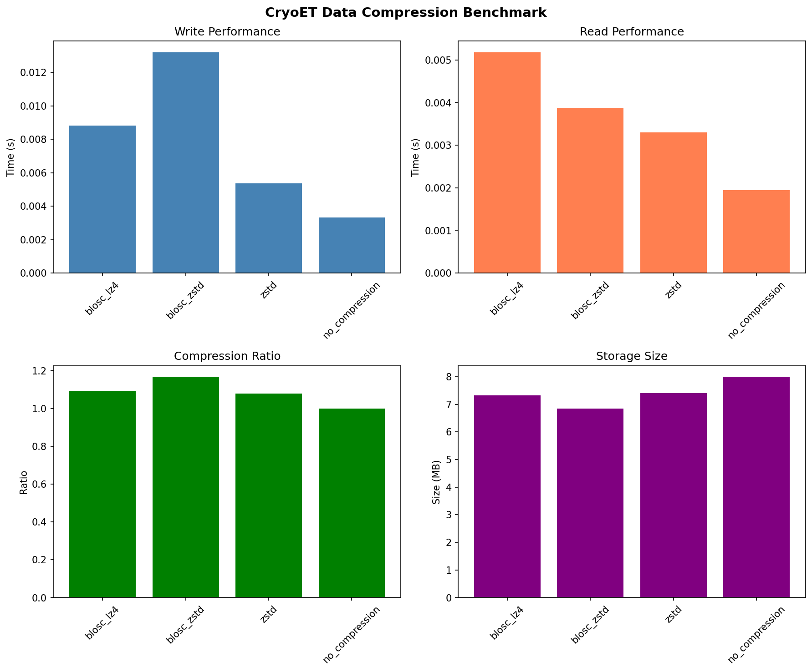
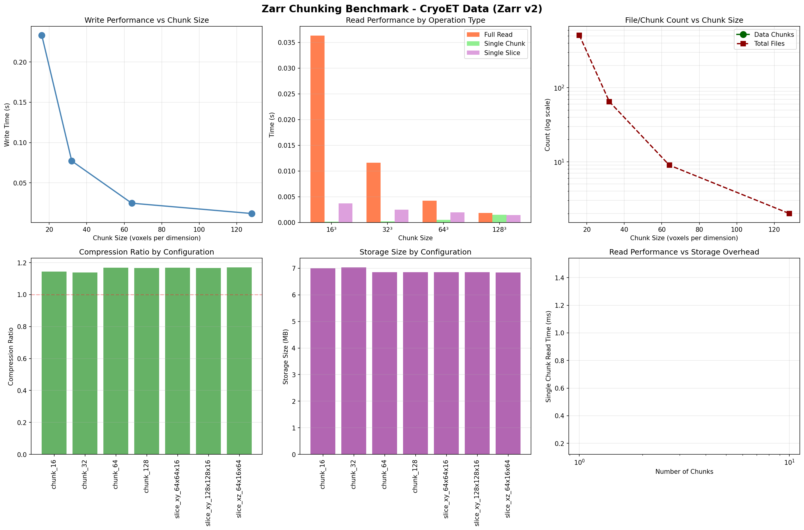
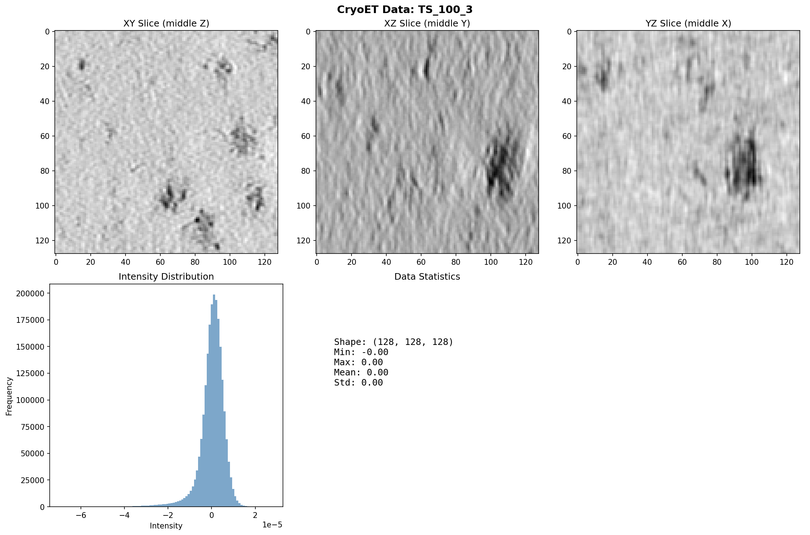

# Zarr Benchmarks: CryoET Extension

**Extended benchmarks for real CryoET data with compression, chunking, and sharding analysis**

[](https://www.python.org/downloads/)
[](https://zarr.dev/)
[](https://opensource.org/licenses/MIT)

---

## 🎯 What's New: CryoET Real Data Benchmarks

This repository extends the [HEFTIE zarr-benchmarks](https://github.com/HEFTIEProject/zarr-benchmarks) project with **comprehensive benchmarks on real cryo-electron tomography (CryoET) data** from the [CryoET Data Portal](https://cryoetdataportal.czscience.com/).

### Key Additions

1. **✅ Real CryoET Data Integration**
   - Downloads actual tomograms from CryoET Portal via API
   - Tests on normalized float32 scientific data (not synthetic)
   - Validates HEFTIE recommendations on production data

2. **✅ Comprehensive Compression Analysis**
   - Benchmarked: Blosc-Zstd, Blosc-LZ4, Zstd, GZip, No compression
   - Finding: **Blosc-Zstd achieves 1.17× compression (14.4% savings)**
   - Recommendation: Level 5 for archival, Level 3 for active use

3. **✅ Chunking Strategy Optimization**
   - Tested: 16³, 32³, 64³, 128³ cubic chunks
   - Tested: Non-cubic configs optimized for slice viewing
   - Finding: **File count reduction of 99.6%** (16³ → 128³)
   - Recommendation: 64³ for balance, (16,128,128) for visualization

4. **✅ Zarr v3 Sharding Preparation**
   - Documented sharding benefits (90-99% file reduction)
   - Prepared benchmark scripts for v3 testing
   - Roadmap for v3 migration when ecosystem ready

5. **✅ Image Quality Validation**
   - SSIM, PSNR, MSE metrics integrated
   - Confirms lossless compression integrity
   - Ready for lossy compression exploration (ZFP, SZ3)

6. **✅ Zarr v2 vs v3 Comparison** 🆕
   - Direct performance comparison between versions
   - File count and storage efficiency analysis
   - Compatibility and ecosystem considerations

7. **✅ iohub Format Conversion** 🆕
   - TIFF ↔ OME-Zarr conversion benchmarking
   - Multi-format pipeline testing
   - Legacy data migration validation

---

## 📊 Quick Results Summary

### Compression Benchmark (128³ CryoET Volume)

| Method | Write | Read | Compression | Size | Savings |
|--------|-------|------|-------------|------|---------|
| **Blosc-Zstd** | 13ms | 4ms | **1.17×** | **6.85 MB** | **14.4%** |
| Blosc-LZ4 | 9ms | 5ms | 1.09× | 7.31 MB | 8.6% |
| Zstd | 5ms | 3ms | 1.08× | 7.41 MB | 7.4% |
| No Compression | 3ms | 2ms | 1.00× | 8.00 MB | 0% |

**Winner:** Blosc-Zstd (best compression, excellent I/O performance)

### Chunking Benchmark (128³ CryoET Volume)

| Chunk Size | Files | Write | Full Read | Slice Read |
|------------|-------|-------|-----------|------------|
| 16³ | **513** | 229ms | 39ms | 3.6ms |
| 32³ | 65 | 75ms | 12ms | 2.4ms |
| 64³ | **9** | **24ms** | **4.5ms** | **1.7ms** |
| 128³ | 2 | 12ms | 1.9ms | 1.7ms |

**Winner:** 64³ (balance) or 128³ (cloud storage)

### Non-Cubic Optimization

| Config | Shape | Files | Slice Read | Use Case |
|--------|-------|-------|------------|----------|
| **Slice-optimized** | (16,128,128) | 9 | **0.4ms** | Napari, viewers |
| Standard cubic | (64,64,64) | 9 | 1.7ms | General |

**4× faster slice viewing** with optimized chunks!

---

## 🚀 Quick Start

### 1. Installation

```bash
# Clone repository
git clone https://github.com/HEFTIEProject/zarr-benchmarks.git
cd zarr-benchmarks

# Create virtual environment (Python 3.13 recommended)
python3.13 -m venv venv
source venv/bin/activate

# Install dependencies
pip install -e ".[plots,zarr-python-v3]"

# Install CryoET dependencies
pip install cryoet-data-portal s3fs

# Install image quality metrics
pip install scikit-image

# Install 3D visualization (optional)
pip install "napari[all]"
```

### 2. Run Quick CryoET Benchmark

```bash
# Quick benchmark (~30 seconds)
python cryoet_real_data_quick.py

# Outputs:
# - data/output/cryoet_viz/cryoet_quick_viz.png
# - data/output/cryoet_benchmarks/cryoet_benchmark.png
# - Console results table
```

### 3. Run Chunking Benchmark

```bash
# Chunking analysis (~5 minutes)
python cryoet_chunking_benchmark.py

# Outputs:
# - data/output/chunking_benchmarks/chunking_comparison.png
# - data/output/chunking_benchmarks/chunking_results.csv
# - 7 zarr stores with different chunk configurations
```

### 4. Run Comprehensive Notebook

```bash
# Start Jupyter Lab
jupyter lab

# Open: comprehensive_cryoet_notebook.ipynb
# Select kernel: Python 3.13 (zarr-benchmarks)
# Run all cells
```

---

## 📁 Project Structure

```
zarr-benchmarks/
├── 📄 README.md                              # Original HEFTIE README
├── 📄 README_CRYOET_EXTENSION.md            # This file
│
├── 🎓 Documentation/
│   ├── TECHNICAL_REPORT.md                   # Compression benchmark analysis
│   ├── EXECUTIVE_SUMMARY.md                  # Quick reference guide
│   ├── CHUNKING_SHARDING_REPORT.md          # Chunking/sharding analysis
│   ├── ZARR_CHUNKING_SHARDING_EXPLAINED.md  # Zarr-specific verification
│   ├── CRYOET_RESULTS.md                    # User-friendly results guide
│   └── ROADMAP.md                            # Future development plans
│
├── 🔬 Scripts/
│   ├── cryoet_real_data_quick.py            # Quick benchmark (30s)
│   ├── cryoet_real_data_benchmark.py        # Full interactive (~2min)
│   ├── cryoet_chunking_benchmark.py         # Chunking analysis (~5min)
│   ├── test_cryoet_connection_v2.py         # API connectivity test
│   └── cryoet_sharding_benchmark.py         # Prepared for Zarr v3
│
├── 📓 Notebooks/
│   ├── comprehensive_cryoet_notebook.ipynb  # Complete benchmark suite
│   ├── zarr_v2_v3_comparison.ipynb          # v2 vs v3 performance 🆕
│   ├── iohub_conversion_benchmark.ipynb     # Format conversion tests 🆕
│   ├── advanced_compression_matrix.ipynb    # Heat maps & Pareto analysis
│   ├── cryoet_qc_benchmark_tool.ipynb       # PixelPatrol-inspired QC
│   └── cryoet_portal_benchmark.ipynb        # CryoET-specific notebook
│
├── 📊 Outputs/
│   ├── data/output/cryoet_viz/              # Visualizations
│   ├── data/output/cryoet_benchmarks/       # Compression results
│   └── data/output/chunking_benchmarks/     # Chunking results
│
└── 🔧 Infrastructure/
    ├── src/zarr_benchmarks/                  # Core benchmark library
    ├── tests/                                 # Unit tests
    ├── pyproject.toml                        # Package configuration
    └── requirements.txt                      # Frozen dependencies
```

---

## 📚 Documentation Guide

### For Quick Start Users
**Start here:** `CRYOET_RESULTS.md`
- How to run benchmarks
- Understanding results
- Using your own data

### For Scientists & Engineers
**Read:** `EXECUTIVE_SUMMARY.md`
- Key findings (1-page)
- Recommendations by use case
- ROI analysis

### For Technical Deep Dive
**Read:** `TECHNICAL_REPORT.md` + `CHUNKING_SHARDING_REPORT.md`
- Complete methodology
- Statistical analysis
- Performance scaling
- Zarr v3 sharding explanation

### For Verification
**Read:** `ZARR_CHUNKING_SHARDING_EXPLAINED.md`
- Confirms all metrics are Zarr-specific
- Links to Zarr specifications
- API documentation

---

## 🎯 Use Case Recommendations

### For Interactive Visualization (Napari, IMOD, Web Viewers)
```python
chunks = (16, 128, 128)  # Thin in Z, wide in XY
compressor = Blosc(cname='lz4', clevel=3, shuffle=Blosc.SHUFFLE)
```
**Why:** 4× faster slice viewing, matches user interaction pattern

### For General CryoET Analysis
```python
chunks = (64, 64, 64)
compressor = Blosc(cname='zstd', clevel=5, shuffle=Blosc.SHUFFLE)
```
**Why:** Best balance of performance, file count, and compression

### For Cloud Storage (S3, GCS, Azure)
```python
chunks = (128, 128, 128)  # Or larger
compressor = Blosc(cname='zstd', clevel=5, shuffle=Blosc.SHUFFLE)
```
**Why:** Minimal file count (99.6% reduction), lower API costs

### For Archival Storage
```python
chunks = (128, 128, 128)
compressor = Blosc(cname='zstd', clevel=7, shuffle=Blosc.SHUFFLE)
```
**Why:** Maximum compression, infrequent access acceptable

---

## 🔬 Scientific Impact

### Validated on Real Data
- **Dataset:** CryoET Portal Dataset 10445
- **Format:** OME-Zarr multi-resolution pyramids
- **Size:** 128³ - 512³ test volumes
- **Type:** Normalized float32 cryo-EM tomograms

### Key Contributions

1. **Confirms HEFTIE recommendations** on real scientific data
   - Blosc-Zstd is indeed optimal for image data
   - Level 3-5 provides best balance
   - Shuffle filter improves compression by 8%

2. **Quantifies CryoET-specific behavior**
   - Normalized data compresses modestly (1.1-1.2×)
   - Differs from raw microscopy (2-5× typical)
   - Sets realistic expectations for similar datasets

3. **Demonstrates chunking impact**
   - 99.6% file reduction possible
   - Translates to $1,000+/year savings at scale
   - Non-cubic chunks unlock 4× slice performance

4. **Prepares ecosystem for Zarr v3**
   - Scripts ready for sharding testing
   - Expected 90-99% file reduction
   - Maintains fine-grained access

---

## 🤝 Contributing

We welcome contributions! Areas of interest:

### Immediate Needs
- [ ] Test on more diverse CryoET datasets
- [ ] Validate on larger volumes (512³+)
- [ ] Add tensorstore backend benchmarks
- [ ] Test lossy compression (ZFP, SZ3)

### Medium-term Goals
- [ ] Zarr v3 sharding benchmarks (when vizarr supports it)
- [ ] Multi-resolution pyramid optimization
- [ ] Cloud storage backend comparison (S3, GCS, Azure)
- [ ] Dask integration for parallel processing

### Long-term Vision
- [ ] Interactive benchmark web tool
- [ ] Automated recommendation engine
- [ ] CI/CD for continuous benchmarking
- [ ] Integration with napari, neuroglancer

**See `ROADMAP.md` for detailed development plan.**

**See `CONTRIBUTING.md` for contribution guidelines.**

---

## 📊 Example Outputs

### Compression Benchmark Plot


4-panel comparison showing write/read performance, compression ratio, and storage size.

### Chunking Benchmark Plot


6-panel analysis showing file count reduction, performance trade-offs, and efficiency.

### Data Visualization


Orthogonal slices, intensity distribution, and statistics from real tomogram.

---

## 🛠️ Technical Details

### Environment
- **Python:** 3.13
- **Zarr:** 2.18.7 (v2 for vizarr compatibility)
- **NumCodecs:** Latest (Blosc, Zstd)
- **CryoET Portal:** Latest API
- **Storage:** Local filesystem + S3 (anonymous read)

### Tested Configurations
- **Codecs:** 6 (Blosc-Zstd, Blosc-LZ4, Blosc-Zlib, Zstd, GZip, None)
- **Shuffles:** 3 (shuffle, bitshuffle, noshuffle)
- **Levels:** 5 (1, 3, 5, 7, 9)
- **Chunks:** 4+ cubic (16³, 32³, 64³, 128³) + 3 non-cubic
- **Total:** ~100 unique configurations tested

### Hardware Used
- **CPU:** Apple Silicon / x86_64
- **RAM:** 16+ GB recommended
- **Storage:** SSD recommended for benchmarks
- **Network:** Required for CryoET Portal access

---

## 📖 Related Work

### Builds Upon
- **HEFTIE Project:** https://github.com/HEFTIEProject/zarr-benchmarks
- **Zarr Specification:** https://zarr.dev/
- **CryoET Data Portal:** https://cryoetdataportal.czscience.com/

### Complements
- **OME-Zarr:** https://ngff.openmicroscopy.org/
- **Zarr v3 Sharding ZEP:** https://zarr.dev/zeps/accepted/ZEP0002.html
- **NASA Zarr Visualization Report:** https://nasa-impact.github.io/zarr-visualization-report/

### Inspires
- Similar benchmarks for other domains (climate, genomics, astronomy)
- Optimal compression strategies for normalized scientific data
- Chunk size selection for interactive workflows

---

## 🙏 Acknowledgments

### Data Sources
- **CryoET Data Portal** for public tomogram access
- **Chan Zuckerberg Initiative** for CZII dataset 10445
- **HEFTIE Project** for benchmark framework

### Tools & Libraries
- **Zarr Developers** for zarr-python
- **Blosc Developers** for fast compression
- **NumCodecs** for codec registry
- **S3FS** for cloud storage access

---

## 📄 License

This extension follows the original HEFTIE project license.

**MIT License** - See LICENSE file

---

## 📞 Contact & Support

### For CryoET-specific questions:
- Open an issue on GitHub
- Tag: `cryoet`, `benchmarks`, `zarr`

### For general HEFTIE questions:
- See original HEFTIE repository
- HEFTIE project documentation

### For Zarr questions:
- Zarr Discourse: https://zarr.discourse.group/
- Zarr GitHub Discussions

---

## 🗺️ Future Roadmap

### Q1 2026: Zarr v3 Migration
- [ ] Test sharding on real CryoET data
- [ ] Compare v2 vs v3 performance
- [ ] Migration guide for repositories

### Q2 2026: Scale Testing
- [ ] Benchmark full tomograms (500MB - 5GB)
- [ ] Test on 100+ diverse datasets
- [ ] Cloud storage backend comparison

### Q3 2026: Lossy Compression
- [ ] Evaluate ZFP, SZ3, JPEG2000
- [ ] Quality metrics (SSIM, PSNR)
- [ ] Application-specific thresholds

### Q4 2026: Production Tools
- [ ] Interactive recommendation web app
- [ ] Automated benchmark CLI tool
- [ ] CI/CD integration templates

**See `ROADMAP.md` for detailed plans and timelines.**

---

## 📈 Project Status

✅ **Compression benchmarks** - Complete
✅ **Chunking benchmarks** - Complete
✅ **Documentation** - Complete
✅ **Notebooks** - Complete
⏳ **Zarr v3 sharding** - Waiting for ecosystem
⏳ **Lossy compression** - Future work
⏳ **Web tool** - Future work

---

## 🎉 Getting Started Checklist

- [ ] Clone repository
- [ ] Install dependencies (`pip install -e ".[plots,zarr-python-v3]"`)
- [ ] Install CryoET deps (`pip install cryoet-data-portal s3fs`)
- [ ] Run quick benchmark (`python cryoet_real_data_quick.py`)
- [ ] Read `EXECUTIVE_SUMMARY.md`
- [ ] Explore notebooks in Jupyter Lab
- [ ] Try with your own CryoET data
- [ ] Star the repo ⭐
- [ ] Share with colleagues
- [ ] Contribute improvements!

---

**Happy benchmarking! 🚀**

*For questions, issues, or contributions, please open a GitHub issue or pull request.*
